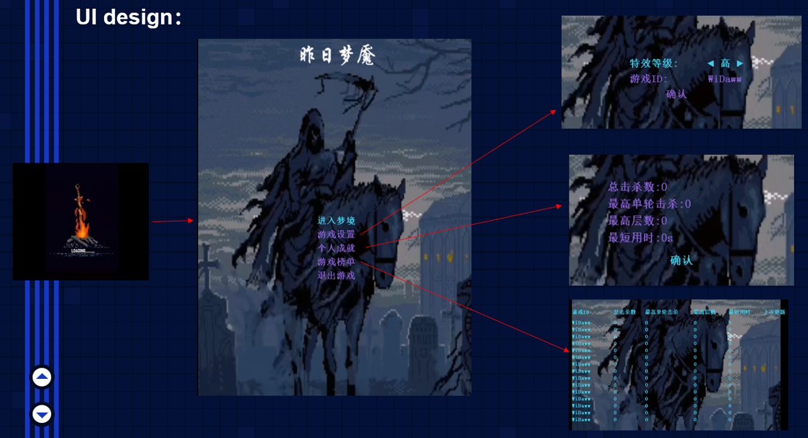
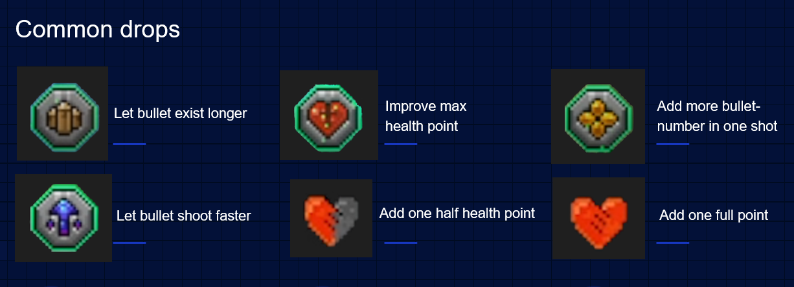
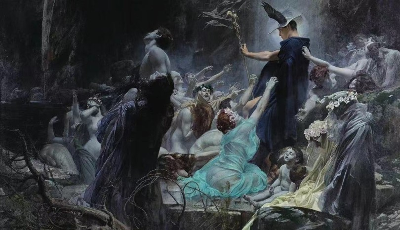
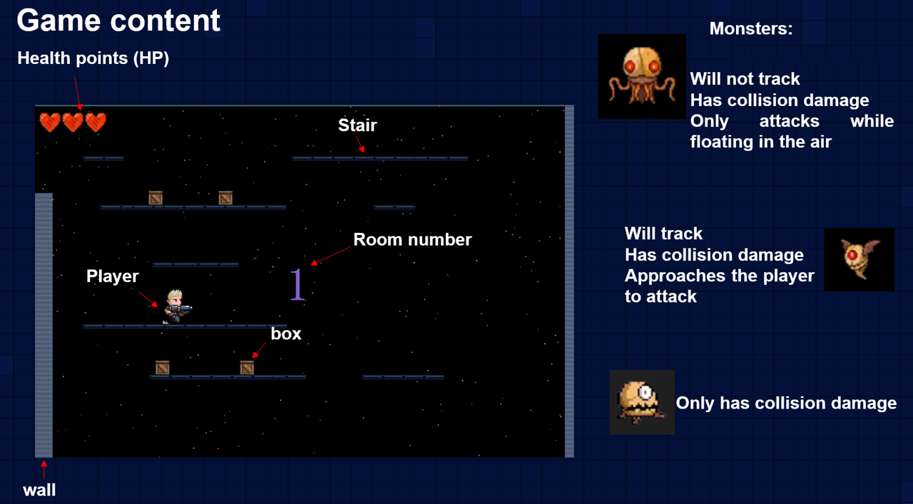

# Yesterday-Nightmare

*A Windows C++ 2D action game using EasyX graphics and WinMM (MCI) audio.*

## Overview
**Yesterday-Nightmare** is a fast-paced single-player action game set in a looping dreamscape. Players fight through room-based levels, defeat monsters, collect power-ups, and push deeper into the nightmare. The project was built to practice modern C++ and object-oriented design, with a focus on clean class hierarchies, sprite animation, collision, and UI flows (menu, settings, achievements, leaderboard).

---

## Visuals

### UI Design


### Common Drops


### Visual Inspiration


### In-game Content



---

## Features
- **Room-based progression** with doors that unlock after clearing enemies.
- **Entity system** (player, enemies, bullets, items, boxes, blocks) with collisions.
- **Sprite & PNG rendering** (alpha-blended) and frame-sequence animations.
- **UI flows**: main menu, settings (graphics/name), achievements, leaderboard.
- **Audio** via WinMM/MCI (BGM & SFX).
- **Local persistence** for player records and settings.

---

## Repository Structure (current)

```text
Yesterday-Nightmare/
├─ README.md
├─ LICENSE
├─ .gitignore
│
├─ src/                       # C++ sources (what VS builds)
│  ├─ Game.cpp
│  ├─ Game.h
│  ├─ GamesBuilder.h
│  ├─ Timer.h
│  ├─ EasyXPng.h
│  ├─ resource.h
│  ├─ Game.rc
│  └─ third_party/           # (optional) vendor headers/libs
│
├─ msvc/                     # Visual Studio solution/project
│  ├─ Game.sln
│  ├─ Game.vcxproj
│  └─ Game.vcxproj.user
│
├─ assets/                   # game assets (recommended home)
│  ├─ img/                   # sprites, sprite-sheets, UI images
│  ├─ data/                  # runtime saves & config (data.gm, config.gm)
│  └─ icons/                 # app/game icons, cursors, etc.
│
├─ music/                    # audio (e.g., bgm.mp3, run.mp3, jump.mp3, shoot.mp3)
│
├─ Markdown/                 # images used by README/markdown docs
│  ├─ UI.png
│  ├─ bar.png
│  ├─ Origin.jpg
│  ├─ realgame.png
│  └─ SHOWCASE.md
│
├─ Figure/                   # gameplay screenshots for reports/slides
│  ├─ 图片1.png ... 图片10.png
│  └─ (any additional figures)
│
└─ docs/                     # reports & slides
   ├─ Final Report.pdf
   ├─ Proposal.pdf
   └─ ShowSlides.pdf
